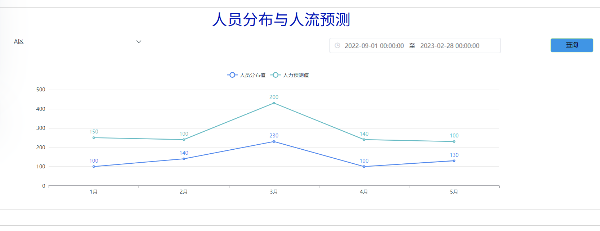

# **建筑区域人员数量统计与预测算法**
- 主要内容：基于建筑内摄像头图像数据，统计各个区域内人员数量。并基于历史人员数量与区域连接拓扑，生成区域间的人员数量转移矩阵，预测未来区域人员数量。

## **0. 代码功能解释**
- 建筑内各区域人员数量统计，每隔五分钟统计一次
- 建筑内各区域人员数量预测，时间戳与人数统计算法完全相同

## **1. 代码环境**
 
```
matplotlib>=3.2.2
numpy>=1.18.5
opencv-python>=4.1.1
Pillow>=7.1.2
PyYAML>=5.3.1
requests>=2.23.0
scipy>=1.4.1
torch>=1.7.0
torchvision>=0.8.1
tqdm>=4.41.0
tensorboard>=2.4.1
pandas>=1.1.4
seaborn>=0.11.0
pymysql
```

- 搭环境的话请按照目录下的requirements.txt 进行安装
```pip install -r requirements.txt```

## **2. 代码运行说明**
- 注：运行代码如下   
``` python detect.py --weights yolov5s.pt --source image```   

## 输入数据：
直接从建筑内的摄像头中利用rstp协议读取视频流，每隔五分钟保存一张图片到指定文件夹下，作为输入数据

## 输出数据
输出各区域人员数量以及预测人员数量至数据中台，如下：
  
|    | datetime         | area\_name | camera\_ip    | num\_detect | num\_predict |
| -- |------------------|--------|---------------|-------------|--------------|
| 0  | 2023-11-22 14:34 | F1-展厅2 | 192.168.11.21 | 0           | 0            |
| 1  | 2023-11-22 14:34 | F1-展厅3 | 192.168.11.22 | 0           | 0            |
| 2  | 2023-11-22 14:34 | F1-展厅1 | 192.168.11.33 | 1           | 1            |
| 3  | 2023-11-22 14:34 | F1-门斗  | 192.168.11.28 | 0           | 0            |
| 4  | 2023-11-22 14:34 | F1-调度室 | 192.168.11.38 | 3           | 3            |
| 5  | 2023-11-22 14:34 | F1-监控室 | 192.168.11.31 | 0           | 0            |
| 6  | 2023-11-22 14:34 | F1-东走廊 | 192.168.11.37 | 0           | 0            |
| 7  | 2023-11-22 14:34 | F2-变电所2 | 192.168.11.36 | 0           | 0            |
| 8  | 2023-11-22 14:34 | F2-变电所1 | 192.168.11.29 | 0           | 0            |
| 9  | 2023-11-22 14:34 | F2-东走廊 | 192.168.11.20 | 0           | 0            |
| 10 | 2023-11-22 14:34 | F2-中走廊 | 192.168.11.35 | 1           | 0            |
| 11 | 2023-11-22 14:34 | F2-西走廊 | 192.168.11.75 | 0           | 0            |
| 12 | 2023-11-22 14:34 | F2-机房  | 192.168.11.23 | 0           | 0            |
| 13 | 2023-11-22 14:34 | F2-会议室 | 192.168.11.76 | 0           | 0            |
| 14 | 2023-11-22 14:34 | F0-走廊1 | 192.168.11.63 | 0           | 0            |
| 15 | 2023-11-22 14:34 | F0-走廊2 | 192.168.11.59 | 0           | 0            |
| 16 | 2023-11-22 14:34 | F0-设备  | 192.168.11.6x | 0           | 0            |
| 17 | 2023-11-22 14:39 | ...    | ...           | ...         | ...          |
| 18 | 2023-11-22 14:39 | ...    | ...           | ...         | ...          |

## **3. 前端展示说明**
